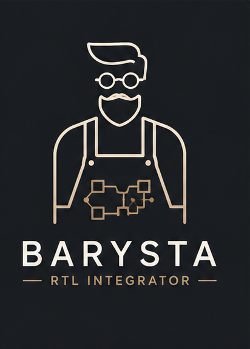

<p align="center">
  <!-- Replace docs/logo.png with your Barysta logo -->
  
</p>

<h1 align="center">Barysta</h1>

<p align="center"><em>A toy RTL integrator — stitching blocks together, one shot at a time.</em></p>

<p align="center"><strong>Written in Racket.</strong></p>

---

## Overview

**Barysta** is a toy RTL integrator built to learn how digital design tooling
works from the inside out. Given a set of RTL blocks and a description of how
they connect, an integrator assembles a top-level design: instantiating
submodules, wiring up ports and buses, resolving parameters, and emitting a
structural top-level netlist.

This is a learning project, not a production tool. It's written in **Racket** on
purpose — RTL integration is essentially a compiler front end (parse interfaces,
build an IR, run passes, emit a netlist), and Racket is a language built for
building languages. S-expressions make a natural IR, macros make emitting
structural HDL pleasant, and REPL-driven development suits a design that's still
taking shape.

## Status

🌱 **Very early.** No code yet. This repo currently exists to reserve the name
and capture intent. Expect it to sit quietly for a while before the first commit.

## Planned scope

- Parse module interface definitions (ports, widths, directions, parameters)
- Represent a design as a connectivity graph of instances and nets
- Resolve parameterization and elaborate the hierarchy
- Detect obvious wiring mistakes (width mismatches, dangling ports, direction conflicts)
- Emit a structural top-level netlist

Nothing here is fixed — it's a sketch to aim at.

## Toolchain

- **Racket** (DrRacket for interactive development)
- **`raco`** for building and package management

Once there's code, the intended workflow will look roughly like:

```bash
raco pkg install --deps search-auto
racket barysta.rkt
```
---
## Definition of Done
 
**You have an RTL integrator when:** it reads two or more module interfaces
(name, ports with direction and width) plus a spec of which ports connect to
which nets, emits valid structural HDL that instantiates and wires them together,
and performs at least one real consistency check (a width mismatch or a dangling
port).
 
The core idea: a design is a graph of instances and nets, and integration is
building that connectivity and serializing it back out. The check is what makes
it a tool rather than a text templater. If two instances come out the far end
wired into a legal top-level module, you have it.
 
- **Floor:** fixed-width, single-bit ports only — skip bus/width handling.
- **Stretch:** resolve one parameter, or flatten one level of hierarchy.
---

*Part of a small suite of toy EDA tools built for learning.*
